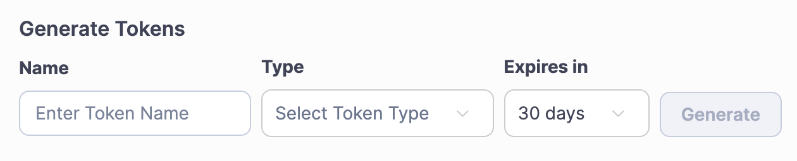
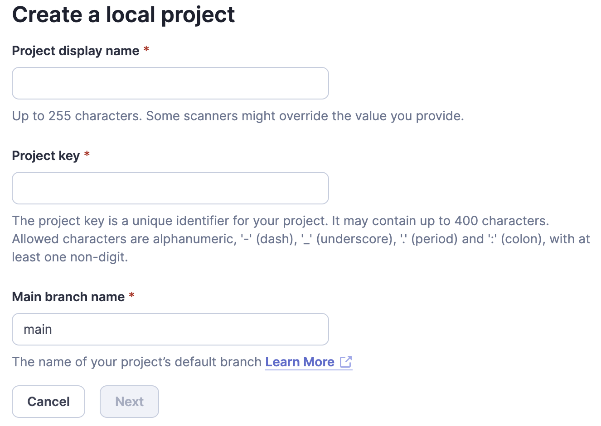

# General

Create all the containers defined in `docker-compose.yml` using the following command.

```ps
docker-compose -f docker-compose-{name}.yml up -d
```

In conjuction with the above command, you can also supply the following.

- `--force-recreate` - Recreate containers even if their configuration and image haven't changed
- `--build` - Build images before starting containers
- `--remove-orphans` - Remove containers for services not defined in the Compose file

## mssql

```ps
docker-compose -f docker-compose-mssql.yml up -d
```

### mssql on `arm` [optional]

> Update: `azure-sql-edge` used to be the only option to run `mssql` on `arm` macs. Now, thanks to _x86_64/amd64 Rosetta emulation on Apple Silicon_, we can use the full version. [Read about it here](https://devblogs.microsoft.com/azure-sql/development-with-sql-in-containers-on-macos/). If you want though, you can still use `azure-sql-edge` using the details below.

The `azure-sql-edge` image which contains a special version of SQL Server designed for IoT/Edge computing which can run on `arm`. There are some [unsupported features](https://learn.microsoft.com/en-us/azure/azure-sql-edge/features#unsupported-features) to be aware of, but is good enough for dev.

```ps
docker-compose -f docker-compose-mssql.yml -f docker-compose-mssql-arm.yml up -d
```

### Initialisation

After creating the container for the first time, you might want to set the following settings. [Reference 🔗](https://learn.microsoft.com/en-us/sql/linux/sql-server-linux-configure-mssql-conf)

**Disable Telemetry**

```bash
/opt/mssql/bin/mssql-conf set telemetry.customerfeedback false
```

**View Current Config**

```bash
cat /var/opt/mssql/mssql.conf
```

## mysql

```ps
docker-compose -f docker-compose-mysql.yml up -d
```

## postgresql

```ps
docker-compose -f docker-compose-postgres.yml up -d
```

## redis

```ps
docker-compose -f docker-compose-redis.yml up -d
```

# Sonarqube

```ps
docker-compose -f docker-compose-sonarqube.yml up -d
```

### Setup

**Login and set new password**

- Browse to `http://localhost:9000/`
- Login using defaults of `admin` / `admin`
- Set a new password

**Create an Auth token**

- Browse to `http://localhost:9000/account/security`
- Generate a new token
  
- Take note of the token, you won't be able to access it again

**Create a project (local)**

- Browse to `http://localhost:9000/projects/create?mode=manual`
- Enter the project details, including a project key
  

\*\* Ensure Oracle Java jdk17 is installed

- On MacOS (view homebrew)
  - `brew install openjdk@17`
  - `sudo ln -sfn /opt/homebrew/opt/openjdk@17/libexec/openjdk.jdk /Library/Java/JavaVirtualMachines/openjdk-17.jdk`
- On Windows
  - TODO update this

** Analyse a project (dotnet scanner) **

- Install (or update) the SonarQube dotnet scanner
  - `dotnet tool update --global dotnet-sonarscanner`
- Begin the analysis
  - `dotnet sonarscanner begin /k:"<project-key>" /d:sonar.token="<sonar-token>" /d:sonar.host.url="http://localhost:9000"`
- Build the project
  - `dotnet build ./src/AzureEventGridSimulator.sln --no-incremental`
- End the analysis
  - `dotnet sonarscanner end /d:sonar.token="<sonar-token>"`

<!-- ```powershell
docker run --rm `
  -e SONAR_HOST_URL="http://host.docker.internal:9000" `
  -e SONAR_SCANNER_OPTS="-Xmx512m -Dsonar.projectKey=AzureEventGridSimulator `
  -e SONAR_TOKEN="sqp_138396c79797c265d2a827589851ba0ff97f9369" `
  -v "/Users/paul.mcilreavy/src/AzureEventGridSimulator:/usr/src" `
  sonarsource/sonar-scanner-cli:latest
```

```bash
docker run --rm \
  -e SONAR_HOST_URL="http://host.docker.internal:9000" \
  -e SONAR_SCANNER_OPTS="-Xmx512m -Dsonar.projectKey=AzureEventGridSimulator" \
  -e SONAR_TOKEN="sqp_138396c79797c265d2a827589851ba0ff97f9369" \
  -v "/Users/paul.mcilreavy/src/AzureEventGridSimulator:/usr/src" \
  sonarsource/sonar-scanner-cli:latest
``` -->

https://docs.sonarsource.com/sonarqube/latest/analyzing-source-code/scanners/sonarscanner-for-dotnet/

```bash
dotnet sonarscanner begin /k:"AzureEventGridSimulator" \
  /d:sonar.token="sqp_138396c79797c265d2a827589851ba0ff97f9369" \
  /d:sonar.host.url="http://localhost:9000" \
  /d:sonar.cs.roslyn.ignoreIssues=false \
  /d:sonar.exclusions="./src/AzureEventGridSimulator.Tests" \
  /d:sonar.tests="./" \
  /d:sonar.test.inclusions="./src/AzureEventGridSimulator.Tests" \
  /d:sonar.cs.opencover.reportsPaths="./TestResults/**/*"; \
  dotnet build ./src -c release -v quiet --nologo --no-incremental; \
  rm -rf ./TestResults; \
  dotnet test ./src --no-build -v quiet --nologo --results-directory "./TestResults" --collect:"XPlat Code Coverage;Format=cobertura,opencover"; \
  dotnet sonarscanner end /d:sonar.token="sqp_138396c79797c265d2a827589851ba0ff97f9369"; \
  rm -rf ./TestResults;


dotnet sonarscanner begin /k:"SeedWork" \
  /d:sonar.token="sqp_8ba66434a6f18ef1d669b12b5cb6aff8abeb93e8" \
  /d:sonar.host.url="http://localhost:9000" \
  /d:sonar.cs.roslyn.ignoreIssues=false \
  /d:sonar.verbose="false" \
  /d:sonar.sources=./src/api/ \
  /d:sonar.tests=./src/api/Todo.Tests/ \
  /d:sonar.exclusions=./src/api/Todo.Tests/; \
  dotnet build ./src/api/SeedWork.sln -c release -v quiet --nologo --no-incremental; \
  dotnet sonarscanner end /d:sonar.token="sqp_8ba66434a6f18ef1d669b12b5cb6aff8abeb93e8";


docker run --rm \
  -e SONAR_HOST_URL="http://host.docker.internal:9000" \
  -e SONAR_SCANNER_OPTS="-Xmx512m -Dsonar.projectKey=SeedWorkFE -Dsonar.sources=./src/cra-template-seedwork" \
  -e SONAR_TOKEN="sqp_9b6f73dd93e19422437d2e285de68f5c1cda826f" \
  -v "/Users/paul.mcilreavy/src/SeedWork:/usr/src" \
  sonarsource/sonar-scanner-cli:latest


sonar.cs.opencover.reportsPaths
  /d:sonar.reportsPaths=./**/*.coverage;
```

dotnet-coverage collect -f xml -o 'coverage-output.xml' -ll verbose 'dotnet test ./src -c debug --no-build --collect:"XPlat Code Coverage;Format=OpenCover"'

dotnet test ./src -c debug --no-build --collect "Code Coverage;Format=opencover"; \
sonar.projectBaseDir=./

export PATH="$PATH:$HOME/.dotnet/tools/"

dotnet tool install -g dotnet-reportgenerator-globaltool

# working

dotnet sonarscanner begin /k:"AzureEventGridSimulator" \
 /v:1.0 \
 /d:sonar.token="sqp_138396c79797c265d2a827589851ba0ff97f9369" \
 /d:sonar.host.url="http://localhost:9000" \
 /d:sonar.exclusions="./src/AzureEventGridSimulator.Tests" \
 /d:sonar.tests="./" \
 /d:sonar.test.inclusions="./src/AzureEventGridSimulator.Tests" \
 /d:sonar.scm.provider=git \
 /d:sonar.scm.disabled=false \
 /d:sonar.verbose=false \
 /d:sonar.cs.opencover.reportsPaths="./**/TestResults/\*/coverage.opencover.xml"; \
 dotnet build ./src/AzureEventGridSimulator.sln -c debug --no-incremental; \
 rm -rf **/TestResults;rm -rf **/bin;rm -rf **/obj;dotnet test ./src -c debug --collect:"XPlat Code Coverage;Format=opencover"; \
 dotnet sonarscanner end /d:sonar.token="sqa_4987ae2c49ba7e62e20a5395d4f566401ff49ad";

rm -rf **/TestResults; \
 dotnet sonarscanner begin /k:"AzureEventGridSimulator" \
 /v:1.0 \
 /d:sonar.token="sqp_138396c79797c265d2a827589851ba0ff97f9369" \
 /d:sonar.host.url="http://localhost:9000" \
 /d:sonar.exclusions="./src/AzureEventGridSimulator.Tests" \
 /d:sonar.tests="./" \
 /d:sonar.test.inclusions="./src/AzureEventGridSimulator.Tests" \
 /d:sonar.scm.provider=git \
 /d:sonar.scm.disabled=false \
 /d:sonar.verbose=false \
 /d:sonar.reportsPaths="./Coverage/Cobertura.xml"; \
 dotnet build ./src/AzureEventGridSimulator.sln -c debug --no-incremental; \
 dotnet test ./src -c debug --no-build --collect:"XPlat Code Coveragez;Format=Cobertura;OpenCover"; \
 reportgenerator -reports:'./**/\*/coverage.cobertura.xml' -targetdir:'./Coverage' -reporttypes:'Cobertura'; \
 dotnet sonarscanner end /d:sonar.token="sqp_138396c79797c265d2a827589851ba0ff97f9369";

cat << \EOF >> ~/.zprofile

# Add .NET Core SDK tools

export PATH="$PATH:/Users/paul.mcilreavy/.dotnet/tools"
EOF

dotnet tool install --global dotnet-sonarscanner

# podman

brew install podman-desktop
podman version

brew install podman # needed?

podman machine init
podman machine start
podman info

https://podman-desktop.io/docs/compose/setting-up-compose
https://github.com/containers/podman-desktop/issues/5334

docker-compose version
podman compose version
